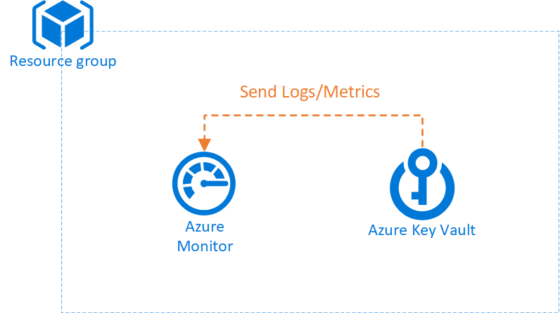
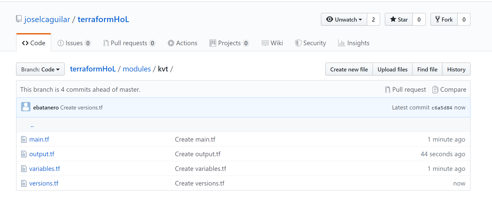

# Terraform Hands-On Lab 2019

_Create and deploy your first template using Terraform_

## Overview

This lab will guide you through the creation of 3 resources using Terraform configuration files. 

The following diagram depicts the final infrastructure that you will have to deploy:

 
 
> **Requirements**: the following tools are needed
> + Terraform
> + Azure CLI
> + Visual Studio code
>  + Extension Name: Terraform https://marketplace.visualstudio.com/items?itemName=mauve.terraform

## Exercise 0 - Generate Resource Group

As an example, we have provisioned a folder with all the configuration files for creating a Resource Group: [Resource group](modules/rsg).

You can use them as a template for the following exercises.

In order to try this module, follow these steps:
1. Login to Azure CLI

    ```azurecli-interactive
    az login
    ```

2. Select the Azure Subscription where you want to deploy

    ```azurecli-interactive
    az account set -s <subscription_id>
    ```
3. Verify if it has been selected

    ```azurecli-interactive
	az account show
    ```
4. Itialize the Terraform configuration directory

    ```azurecli-interactive
	terraform init
    ```
5. Validate the code

    ```azurecli-interactive
	terraform validate
    ```
6. Create an execution plan
    ```azurecli-interactive
	terraform plan
    ```
7. Create the resource group
    ```azurecli-interactive
	terraform apply
    ```
Once deployed, the Resource Group should have been created in your subscription.


## Exercise 1 - Generate Key Vault

In this exercise, we will create the configuration files needed to generate a **Key Vault**. 

In the repository you will find a folder named [kvt](/modules/kvt) . Inside it, you will find all the files that Terraform needs for deploying a resource. 



The key vault should have the following attributes:

+ Disk encryption should be enabled.
+ Template deployment should be enabled.
+ (Optional) Access Policy: at least one user should have these permissions:
  + Secret: get, list, set
  + Storage: get
+ Two tags: 
  + environment:  should be inherited from RG.
  + channel.

Moreover, your module should have the following outputs:
+ Key Vault ID
+ Key Vault name


How can you start?

1. _Main.tf_: fill the block _resource_ bearing in mind all the requirements.
2. _Variables.tf_: define all the variables. Remember that you should have already defined them in Main file.
3. _Output.tf_: add all the requested outputs. Take a look at RG outputs file.
4. _versions.tf_: as you are using Terraform 12, you should constrain terraform to a specific version or a range of versions.

## Exercise 2 - Generate Log Analytics workspace

In this exercise, we will create the configuration files needed to generate a **Log Analytics Workspace**. You will need to create all the configuration files from scratch. 

The Log Analytics should have the following attributes:

+ Tags: should be inherited from RG.
+ Location: inherit from RG.


Moreover, your module should have the following outputs:
+ Log Analytics ID
+ Log Analytics name

How can you start?

1. Create the file structure.
2. Follow same steps explained for exercise 2.


## Exercise 3 (BONUS) - Create blueprint

If you have already finished the previous exercises, you are prepared to **create your first blueprint**, being blueprint a set of modules. 

The goal of this exercise is to create a blueprint that generates a Resource Group, a Log Analytics Workspace and a Key Vault which sends its logs to the Log Analytics Workspace via diagnostic setting.